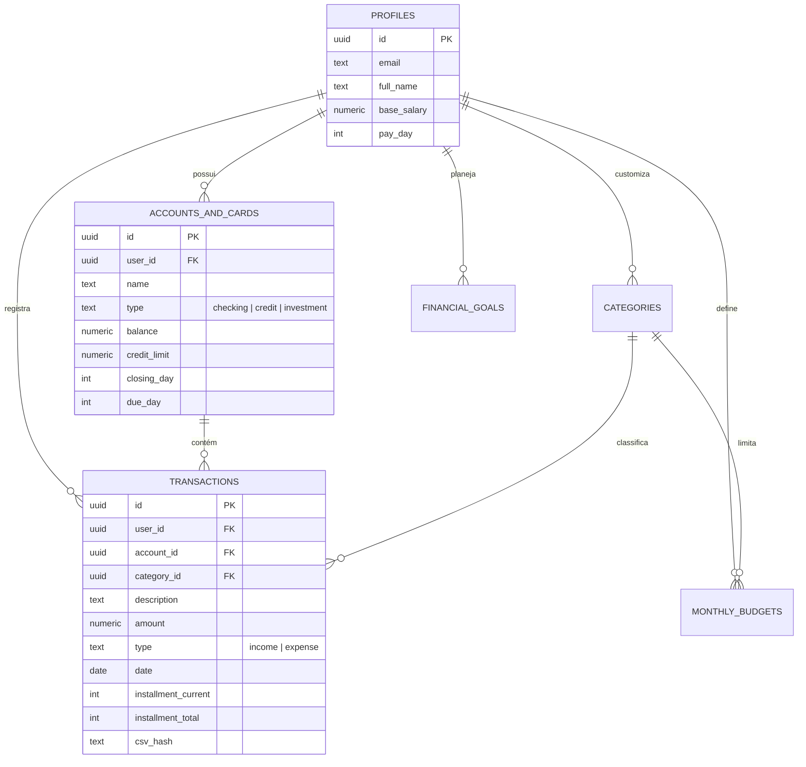

<div align="center">

# 💰 ArrumaBolso
### **Plataforma de Gestão Financeira Pessoal, Previsibilidade Orçamentária & Inteligência de Gastos**

[](https://nextjs.org/)
[](https://www.typescriptlang.org/)
[](https://tailwindcss.com/)
[](https://supabase.com/)
[](./LICENSE)

*Substitua planilhas anuais complexas por uma experiência fluida, inteligente, segura e totalmente adaptada ao ecossistema financeiro brasileiro (com suporte nativo a importações de faturas e extratos Nubank).*

[Manual do Usuário](#-manual-de-uso-da-aplicação) • [Arquitetura & Tecnologias](#-arquitetura-e-tecnologias) • [Instalação Local](#-como-executar-localmente) • [Hospedagem na Vercel](#-deploy-e-hospedagem-na-vercel)

---

</div>

## 📌 Sumário

1. [Visão Geral](#-visão-geral)
2. [Recursos e Destaques](#-recursos-e-destaques)
3. [Arquitetura e Tecnologias](#-arquitetura-e-tecnologias)
   - [Stack Tecnológica](#stack-tecnológica)
   - [Estrutura de Diretórios](#estrutura-de-diretórios)
   - [Modelo de Dados (Supabase PostgreSQL + RLS)](#modelo-de-dados-supabase-postgresql--rls)
   - [Algoritmos de Previsibilidade](#algoritmos-de-previsibilidade)
4. [Manual de Uso da Aplicação](#-manual-de-uso-da-aplicação)
   - [1. Primeiro Acesso e Autenticação](#1-primeiro-acesso-e-autenticação)
   - [2. Configuração Inicial (Contas e Cartões)](#2-configuração-inicial-contas-e-cartões)
   - [3. Lançamento e Gestão de Transações](#3-lançamento-e-gestão-de-transações)
   - [4. Importação Inteligente Nubank (CSV / OFX)](#4-importação-inteligente-nubank-csv--ofx)
   - [5. Planejamento Orçamentário e Metas](#5-planejamento-orçamentário-e-metas)
   - [6. Custos Fixos e Dívidas Recorrentes](#6-custos-fixos-e-dívidas-recorrentes)
   - [7. Modo Privacidade e Atalhos de Teclado](#7-modo-privacidade-e-atalhos-de-teclado)
5. [Como Executar Localmente](#-como-executar-localmente)
6. [Deploy e Hospedagem na Vercel](#-deploy-e-hospedagem-na-vercel)
7. [Licença e Contribuição](#-licença)

---

## 🌟 Visão Geral

O **ArrumaBolso** nasceu para resolver o problema clássico de falta de visibilidade sobre o futuro financeiro. Diferente de aplicações financeiras convencionais que apenas registram o passado, o **ArrumaBolso** calcula com precisão matemática:
- **Quanto sobra no final do mês considerando parcelamentos futuros.**
- **Qual é o seu limite de gastos seguro diário (*Burn Rate*).**
- **Como estará seu fluxo de caixa nos próximos 12 meses.**
- **Se seus hábitos atuais manterão ou comprometerão suas metas de economia.**

A interface foi projetada sob diretrizes modernas de UX/UI, com suporte completo a **Dark Mode e Light Mode**, paletas de cores refinadas, responsividade perfeita para celulares e suporte a modo offline/demo.

---

## 🚀 Recursos e Destaques

- **Dashboard Executivo:**
  - **Score de Saúde Financeira (0 a 100):** Cálculo ponderado baseado em liquidez, índice de comprometimento de renda, taxa de poupança e dívidas.
  - **KPIs em Tempo Real:** Saldo consolidado, receitas do mês, despesas totais e taxa de economia líquida.
  - **Gráfico de Fluxo de Caixa (12 Meses):** Projeção preditiva com barras empilhadas separando parcelas de cartão e custos fixos.
  - **Burn Rate Diário:** Termômetro que calcula em tempo real o gasto diário seguro para não estourar o orçamento.
  - **Insights Financeiros com IA:** Dicas contextuais automáticas sugerindo corte de excessos e otimização de aportes.
- **Importador Inteligente Nubank & OFX:**
  - Leitura nativa de **Faturas de Cartão de Crédito** e **Extratos de NuConta** em CSV.
  - Leitura de arquivos bancários universais **OFX**.
  - **Deduplicação Inteligente:** Hash determinístico SHA-like para impedir duplicidade de lançamentos.
  - **Detecção de Parcelamentos:** Extração automática de dados como `"Mercado Livre (02/06)"`.
  - **Categorização Automática:** Reconhecimento instantâneo de centenas de estabelecimentos brasileiros (iFood, Uber, Netflix, Carrefour, Droga Raia, etc.).
- **Gestão Completa de Cartões & Contas:**
  - Visualização gráfica de faturas com dia de fechamento e dia de vencimento.
  - Medidor de comprometimento de limite de crédito.
- **Planejamento & Metas:**
  - Tetos de gastos por categoria com alertas visuais de estouro.
  - Metas com barra de progresso, prazos estimados e aportes graduais.
- **Privacidade & Segurança:**
  - **Modo Privacidade:** Oculte todos os valores com um clique ou pressionando a tecla `H`.
  - **Row Level Security (RLS):** Isolamento criptográfico estrito por usuário no banco de dados.

---

## 🏗 Arquitetura e Tecnologias

### Stack Tecnológica

| Camada | Tecnologia | Descrição |
| :--- | :--- | :--- |
| **Framework Web** | [Next.js 14+](https://nextjs.org/) | App Router, Server Components e Otimizações de Edge |
| **Linguagem** | [TypeScript 5](https://www.typescriptlang.org/) | Tipagem estrita de ponta a ponta |
| **Estilização** | [Tailwind CSS](https://tailwindcss.com/) | Design system modular, temas dinâmicos e responsividade |
| **Componentes UI** | Radix UI / Headless UI | Primitivas acessíveis, modais, drawers e menus |
| **Ícones** | [Lucide React](https://lucide.dev/) | Mais de 1000 ícones vetoriais modernos |
| **Gráficos** | [Recharts](https://recharts.org/) | Visualizações interativas SVG (Linhas, Barras, Rosca) |
| **Banco de Dados** | [Supabase PostgreSQL](https://supabase.com/) | Banco relacional escalável com RLS nativo |
| **Autenticação** | Supabase Auth + Google OAuth | Sessões JWT seguras, OAuth 2.0 e login por email |
| **Manipulação CSV**| [PapaParse](https://www.papaparse.com/) | Parser de arquivos tabulares em alta performance |
| **Manipulação Datas**| [date-fns](https://date-fns.org/) | Cálculos temporais e internacionalização pt-BR |
| **Notificações** | [Sonner](https://sonner.emilkowal.ski/) | Sistema de Toasts elegantes e não intrusivos |

---

### Estrutura de Diretórios

```plaintext
gestaofinanceira/
├── public/                     # Assets estáticos, ícones e arquivos de amostra CSV
│   ├── arrumabolso-icon.svg    # Identidade visual oficial
│   ├── samples/                # Arquivos CSV de exemplo do Nubank para testes
│   └── manifest.json           # Manifesto PWA para instalação no celular
├── src/
│   ├── app/                    # Rotas da aplicação (Next.js App Router)
│   │   ├── page.tsx            # Dashboard principal
│   │   ├── transactions/       # Extrato completo e filtros de transações
│   │   ├── incomes/            # Visão dedicada de receitas
│   │   ├── expenses/           # Visão dedicada de despesas
│   │   ├── cards/              # Gestão de cartões de crédito e contas
│   │   ├── fixed-debts/        # Custos fixos e dívidas recorrentes
│   │   ├── planning/           # Orçamentos e tetos por categoria
│   │   ├── goals/              # Metas financeiras e reservas
│   │   ├── import/             # Importador de CSV/OFX e simulador
│   │   ├── settings/           # Configurações de perfil, temas e privacidade
│   │   ├── login/              # Tela de autenticação (Email + Google)
│   │   └── api/                # Endpoints e webhooks de suporte
│   ├── components/             # Componentes modulares reutilizáveis
│   │   ├── auth/               # Modais e barreiras de proteção de rota
│   │   ├── dashboard/          # Cards de KPI, gráficos Recharts e Burn Rate
│   │   ├── import/             # Dropzone de arquivos, preview e tabelas
│   │   ├── layout/             # Sidebar desktop, Topbar e Bottom Navigation mobile
│   │   ├── providers/          # Provedores de contexto (Período, Privacidade, Query)
│   │   └── ui/                 # Botões, inputs com máscara BRL, logos, modais
│   ├── hooks/                  # Custom React Hooks (useFinancial, useKeyboard)
│   └── lib/                    # Lógica de negócio pura e utilitários
│       ├── financial/          # Motores matemáticos de Projeção e Burn Rate
│       ├── parsers/            # Parsers de CSV Nubank, OFX e regras preditivas
│       ├── services/           # Camada de comunicação Supabase / LocalStorage
│       └── supabase/           # Configuração do cliente Supabase e tipagens DB
└── supabase/                   # Scripts DDL de migração e políticas RLS
    └── migrations/             # Esquema completo do banco PostgreSQL
```

---

### Modelo de Dados (Supabase PostgreSQL + RLS)

A aplicação conta com um banco relacional fortemente estruturado com chaves estrangeiras em cascata e **Row Level Security (RLS)** ativado em todas as tabelas:



---

### Algoritmos de Previsibilidade

#### 1. Projeção de Fluxo de Caixa (12 Meses)
Localizado em `src/lib/financial/projection-engine.ts`, o motor realiza uma simulação temporal estendida:
- Considera o salário recorrente base do usuário no dia configurado.
- Adiciona custos fixos recorrentes (aluguel, planos, assinaturas).
- Processa compras parceladas, reduzindo mês a mês o impacto financeiro das parcelas que se encerram.
- Plota visualmente o saldo final projetado de cada mês com detalhamento das categorias.

#### 2. Termômetro de Burn Rate (Ritmo de Gasto Diário)
Localizado em `src/lib/financial/burn-rate.ts`, o cálculo monitora se você chegará ao fim do mês com saldo positivo:
$$\text{Limite Diário Seguro} = \frac{\text{Orçamento Restante do Mês}}{\text{Dias Restantes}}$$
$$\text{Ritmo Atual} = \frac{\text{Despesas Totais Realizadas}}{\text{Dias Decorridos no Mês}}$$
Se $\text{Ritmo Atual} > \text{Limite Seguro}$, o card aciona um alerta âmbar/vermelho indicando a necessidade de desaceleração.

---

## 📖 Manual de Uso da Aplicação

### 1. Primeiro Acesso e Autenticação
Ao acessar a plataforma:
- **Login com Google:** Clique em **"Entrar com o Google"** para login sem senha com autenticação OAuth segura.
- **Login com Email/Senha:** Cadastre sua conta na aba "Cadastre-se" com nome, email e senha.
- **Modo Demo (Sem Login):** Clique no botão **"Entrar no Modo Demonstração"** para navegar imediatamente por dados simulados pré-carregados (ideal para apresentações ou testes rápidos sem banco em nuvem).

### 2. Configuração Inicial (Contas e Cartões)
1. Vá até a aba **Cartões e Contas** (`/cards`).
2. Clique em **"Nova Conta / Cartão"**:
   - **Conta Corrente:** Defina o banco (ex: Nubank, Itaú, Inter) e o saldo atual inicial.
   - **Cartão de Crédito:** Informe o limite de crédito total, o **Dia de Fechamento** e o **Dia de Vencimento** da fatura. O sistema usará esses dias para determinar em qual mês cada compra cairá.

### 3. Lançamento e Gestão de Transações
- **Atalho Rápido:** Pressione a tecla `N` em qualquer tela ou clique em **"+ Nova Transação"**.
- Preencha:
  - **Tipo:** Receita ou Despesa.
  - **Valor:** Digite o valor monetário com formatação automática em R$.
  - **Categoria:** Escolha a categoria (Alimentação, Transporte, Moradia, etc.).
  - **Conta/Cartão:** Escolha a forma de pagamento.
  - **Parcelamento:** Se a compra foi parcelada, ative a opção e informe o número de parcelas (ex: `10x`). O sistema criará automaticamente as parcelas nos meses subsequentes.

### 4. Importação Inteligente Nubank (CSV / OFX)
Para nunca mais digitar transações manualmente:
1. Abra o app do **Nubank** no celular, vá na fatura fechada ou atual e selecione **"Exportar fatura em CSV"** (ou exportar extrato da NuConta).
2. Acesse a aba **Importador** (`/import`) no ArrumaBolso.
3. Arraste o arquivo CSV ou selecione no seu computador.
4. **O sistema irá:**
   - Detectar automaticamente se é fatura de cartão ou conta corrente.
   - Identificar compras parceladas (ex: `"Mercado Livre 01/05"`).
   - Classificar as categorias automaticamente através de IA baseada em palavras-chave.
   - Comparar o arquivo com o banco de dados e destacar transações duplicadas em amarelo.
5. Revise as linhas, selecione as que deseja salvar e clique em **"Importar Transações"**.

### 5. Planejamento Orçamentário e Metas
- **Orçamentos:** Na aba **Planejamento** (`/planning`), estipule um teto de gastos para cada categoria (ex: R$ 800,00 para Lazer). O card exibirá uma barra percentual dinâmica que muda de cor conforme você se aproxima do limite.
- **Metas Financeiras:** Na aba **Metas** (`/goals`), crie objetivos como *"Reserva de Emergência"* ou *"Viagem de Férias"*. Cada vez que economizar um valor, registre um aporte para acompanhar o termômetro até atingir 100%.

### 6. Custos Fixos e Dívidas Recorrentes
Na aba **Custos Fixos** (`/fixed-debts`), cadastre pagamentos que ocorrem todo mês (aluguel, condomínio, internet, streamings, escola). O motor de projeção usará essas despesas automaticamente para os cálculos dos próximos 12 meses.

### 7. Modo Privacidade e Atalhos de Teclado

| Atalho | Ação |
| :--- | :--- |
| `H` | **Ativar / Desativar Modo Privacidade** (Oculta todos os valores numéricos com `••••••`) |
| `N` | **Abrir Modal de Nova Transação** instantaneamente |
| `Ctrl + K` ou `Cmd + K` | **Abrir Command Palette** para busca e navegação rápida entre páginas |
| `Esc` | Fechar qualquer modal ou gaveta aberta |

---

## 💻 Como Executar Localmente

### Pré-requisitos
- [Node.js](https://nodejs.org/) versão 18.17 ou superior.
- [npm](https://www.npmjs.com/) ou [pnpm](https://pnpm.io/).

### Passo a Passo

```bash
# 1. Clone o repositório
git clone https://github.com/NetoNog/ArrumaBolso.git

# 2. Acesse o diretório
cd ArrumaBolso

# 3. Instale as dependências
npm install

# 4. Configure as variáveis de ambiente
cp .env.example .env.local
# Preencha suas credenciais do Supabase no arquivo .env.local

# 5. Inicie o servidor de desenvolvimento
npm run dev
```

Acesse [http://localhost:3000](http://localhost:3000) no seu navegador.

---

## ☁️ Deploy e Hospedagem na Vercel

O projeto foi totalmente otimizado para deploy contínuo (*CI/CD*) na **Vercel**:

1. Crie uma conta ou faça login na [Vercel](https://vercel.com/).
2. Clique em **"Add New..."** > **"Project"** e selecione o repositório `NetoNog/ArrumaBolso`.
3. Na seção **Environment Variables**, adicione as chaves:
   - `NEXT_PUBLIC_SUPABASE_URL`: URL do seu projeto no Supabase.
   - `NEXT_PUBLIC_SUPABASE_ANON_KEY`: Chave anônima (public anon key) do Supabase.
4. Clique em **"Deploy"**.
5. **Configuração de Redirecionamento (Supabase & Google Cloud):**
   - No painel do **Supabase** (`Authentication > URL Configuration`), defina a **Site URL** com o link gerado pela Vercel (ex: `https://arrumabolso.vercel.app`) e adicione `https://arrumabolso.vercel.app/**` nas **Redirect URLs**.
   - No **Google Cloud Console**, adicione o domínio da Vercel nas **Origens JavaScript autorizadas**.

---

## 📄 Licença

Este projeto está sob a licença MIT. Consulte o arquivo [LICENSE](./LICENSE) para mais detalhes.

---

<div align="center">
Desenvolvido com foco em alta performance, usabilidade e controle financeiro de verdade. 🚀
</div>
